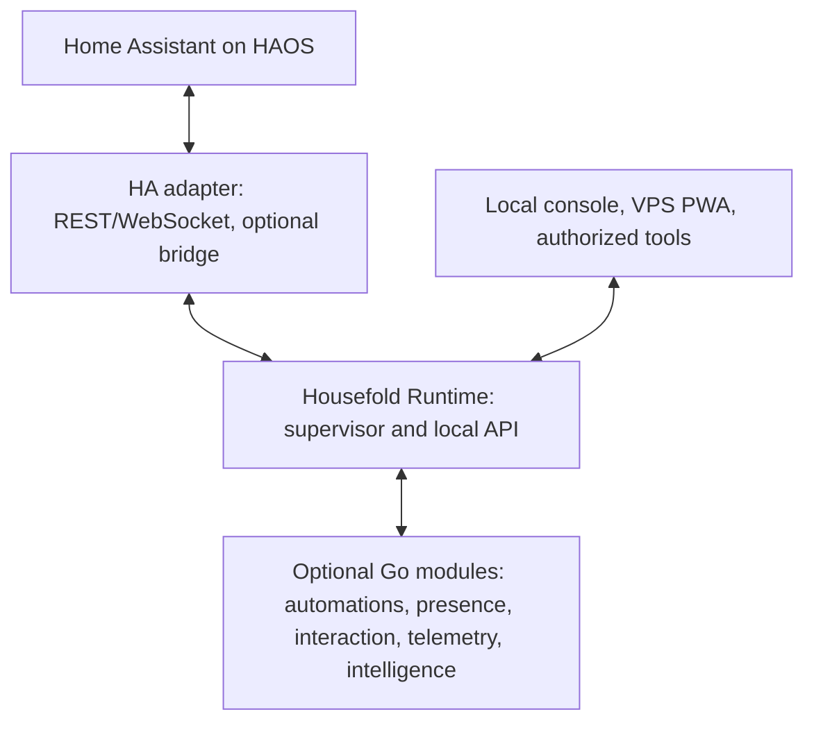

# Housefold — System Architecture

**Status:** Draft for review  
**Date:** 25 September 2026  
**Depends on:** [Housefold Project Vision](Housefold_Project_Vision.md)  
**Scope:** Logical components, deployment boundaries, data paths, and failure behavior. Detailed subsystem contracts and unresolved decisions belong in their own specifications and ADRs.

## 1. Architecture goals

Housefold adds a reliable Go control and capability layer around Home Assistant (HA). HA remains responsible for device integrations and the authoritative device/entity state. Housefold owns its local runtime, module lifecycle, higher-level house behavior, and the interfaces it offers to its UI and modules.

The architecture must:

- Keep essential, latency-sensitive control local to the HAOS machine.
- Keep the runtime manageable when the VPS, internet, cloud services, bridge, or any optional feature module is unavailable.
- Let a household install capabilities independently.
- Keep HA-specific details behind one integration boundary and expose a normalized Housefold API to modules.
- Update Go components without losing the last healthy version or allowing overlapping active automation versions.
- Provide a safe path from basic HA REST/WebSocket connectivity to an optional integration bridge with deeper event and discovery access.
- Support a remotely hosted PWA while retaining a local recovery and management interface.

## 2. Logical architecture

The diagram shows logical relationships. It does not prescribe whether each component is a separate process or container, nor the transport between every component. Those choices must preserve the failure and security boundaries below.

### Home Assistant

HA is the device and integration substrate. Its integrations connect to lights, sensors, media devices, and other equipment. HA remains authoritative for raw entity state and service execution. Housefold does not duplicate device compatibility logic.

### HA adapter and optional bridge

The adapter translates HA states, events, service descriptions, and service calls into Housefold's normalized concepts. The initial connection uses HA REST and WebSocket APIs so a clean install works without installing a custom integration.

An optional HA integration bridge can provide deeper or more efficient event and discovery access. Enabling it should be a guided operation. Once verified, the runtime can prefer the bridge for supported capabilities while retaining REST/WebSocket as fallback and recovery paths. The bridge is an adapter, not a place for automation or household business rules.

### Housefold Runtime

The runtime is the required, always-on local supervisor and control plane for Housefold. It:

- Starts on the HAOS machine and serves a minimal management/recovery console.
- Manages module installation, configuration, process lifecycle, health, updates, rollback, and safe recovery.
- Owns the normalized Housefold API and HA connection lifecycle, including reconnect and state reconciliation.
- Exposes runtime and module health and a bounded operational history.
- Ensures a failed module or deployment does not take down management or unrelated modules.

The runtime should be generic: it supervises modules through declared contracts and capabilities rather than embedding feature-specific behavior for each module type.

### Optional modules

Modules provide capabilities such as native Go automations, presence, interactions and notifications, telemetry, and intelligence. They communicate through versioned Housefold contracts rather than depending directly on HA internals or one another's private APIs. A module declares the capabilities it needs and exposes health/readiness for supervision.

The runtime can run with no optional modules installed. One module's absence or failure must not disable the runtime or unrelated capabilities. Local critical behavior must not depend on intelligence or cloud services.

Automation source is ordinary Go code; Housefold does not introduce a DSL or an intermediate execution language. The automation module consumes generated or otherwise typed views of discovered HA entities and invokes the normalized runtime API. The generation workflow and exact binding format are specified separately.

### User and agent clients

The runtime serves a lightweight local console for setup, health, and recovery. The full Housefold PWA is optional and may be hosted on the VPS for remote access and the daily home experience. Its loss must not stop local automation or remove the runtime's local management path.

Authorized tools and diagnostic agents may use explicit runtime APIs. They receive only the capabilities and data authorized for their role. Cloud models are optional clients behind the privacy and authorization boundary, not privileged runtime components.

## 3. Deployment topology

### HAOS machine

The HAOS machine (currently a 2012 Mac mini) hosts Home Assistant and the mandatory Housefold Runtime. The runtime and latency-critical Go modules execute locally. This is the home control plane and the only location required for essential local reactions.

The HA bridge, if installed, runs in the HA environment and connects to the runtime through a supported, versioned interface. Since HA integrations/add-ons and runtime components may be isolated in separate containers, their contract must work across a network boundary. Unix-domain sockets may be used only between processes that share an appropriate filesystem namespace; they are not assumed to cross container boundaries.

### VPS

The VPS can host the full PWA, remote-facing services, longer-term history, builds, or heavier noncritical analysis. The VPS communicates with the local runtime through an authenticated, encrypted, outbound-established connection or another explicitly secured remote-access path. The precise tunnel and authentication design remains open.

No essential local automation may require a live VPS connection. The local runtime continues operating during disconnection and reconciles permitted data after reconnection. Cloud AI calls follow the separate privacy policy and are not part of the control path.

### Installation and connection stages

1. Install and start the runtime on HAOS.
2. Connect it to HA using the standard REST and WebSocket APIs; show connection and permission status in the local console.
3. Offer the optional bridge when the user wants deeper event/discovery support. Guide setup and verify the bridge before switching supported traffic to it.
4. Install desired feature modules independently.
5. Optionally connect a VPS hosted PWA or other authorized remote clients.

Removing or losing the bridge returns the adapter to REST/WebSocket for supported functions. Removing the full PWA leaves the local console and runtime available.

## 4. Main data paths

### State and event ingestion

1. HA publishes state changes and events through the selected adapter path.
2. The adapter validates and maps HA-specific payloads into versioned Housefold event and state types.
3. The runtime maintains current connection status and reconciles state after reconnect; it does not treat cached state as authoritative after a gap.
4. The runtime dispatches normalized observations to subscribed modules.
5. Modules retain only the state needed for their function and report health and significant outcomes to the runtime.

The event journal, retention policy, ordering guarantees, and replay semantics require a dedicated data/telemetry specification. Until defined, modules must not assume durable, exactly-once event delivery.

### Automation action

1. A local observation reaches the automation module through the normalized API.
2. Native Go automation code evaluates its deterministic rules and requests a service action through the runtime.
3. The adapter maps that request to HA's service interface.
4. HA executes the action through its device integration and publishes resulting state.
5. The runtime records enough outcome information to explain execution and failure without unnecessarily retaining sensitive payloads.

A VPS, cloud LLM, remote PWA, or optional intelligence module is not on this path.

### Remote user interaction

1. The PWA connects to a secured Housefold endpoint or relay.
2. The runtime authenticates and authorizes the client and exposes only supported Housefold operations.
3. Commands are validated locally and passed through the same normalized action boundary used by local modules.
4. If the remote connection drops, local behavior continues; the PWA reports that remote control is unavailable rather than implying a command succeeded.

The exact remote command and acknowledgement contract belongs in the API and security specifications.

### Module deployment and activation

1. A trusted module package and manifest are checked for provenance, compatibility, requested capabilities, and policy.
2. The runtime stages the new version without overwriting the active healthy version.
3. The candidate starts in isolation and must report readiness within defined limits.
4. For modules that execute automations, the runtime transfers the execution lease, drains or fences the prior version, and activates the candidate so only one healthy version can issue actions.
5. A failed candidate is stopped and the previous healthy version remains or is restored.

The exact package format, lease protocol, health thresholds, and atomic filesystem operations require a runtime specification and ADR. The invariant is that a failed update cannot silently replace the last healthy module or create two active automation versions.

## 5. Interface boundaries

| Boundary | Architectural contract | Status |
| --- | --- | --- |
| HA ↔ adapter | REST and WebSocket support basic setup; optional bridge adds richer HA events/discovery; fallback and reconnect are required. | Direction settled; detailed API behavior to specify. |
| Adapter ↔ runtime | Translate HA concepts into a versioned, normalized Housefold model; keep HA-specific handling out of feature modules. | Required; schema and transport open. |
| Runtime ↔ module | Versioned module lifecycle and capability contract with health/readiness, configuration, and bounded APIs. | Required; protocol and process model open. |
| Local console ↔ runtime | Local setup, status, safe recovery, and module management. | Required; UI contract open. |
| VPS PWA ↔ runtime | Authenticated remote access through a secured path; no dependency for local control. | Optional deployment; transport and identity open. |
| Cloud AI ↔ privacy boundary | Minimized or transformed data, explicit policy, restricted outputs and actions. | Optional; detailed privacy and authority policy required before implementation. |

Modules should request capabilities rather than infer system layout. For example, an automation module needs state subscriptions and service invocation; it should not need direct access to HA credentials or the bridge's private transport.

## 6. Failure and recovery behavior

| Failure | Required behavior |
| --- | --- |
| VPS or internet unavailable | Local runtime and essential local automations continue. Remote UI and cloud features show unavailable status. Any approved outbound history is queued or dropped according to its retention policy. |
| HA temporarily disconnected | Runtime and management console remain available, mark HA data stale, reconnect with bounded backoff, then reconcile current state before resuming state-dependent work. Actions are not reported successful until confirmed by the defined contract. |
| Bridge unavailable | Use REST/WebSocket for supported operations. Mark bridge-enhanced capabilities degraded and guide repair without making the runtime inaccessible. |
| Optional module crashes | Runtime restarts or quarantines that module according to policy. Other modules and runtime management remain available. |
| Candidate module fails health/readiness | Reject activation and retain or restore the last healthy version. Never activate two automation versions concurrently. |
| Runtime update fails | Keep or restore a bootable previous runtime version and a local recovery path. Runtime update behavior must be specified and tested before unattended updates are enabled. |
| Storage or resource pressure | Preserve runtime health and local control first; expose pressure, apply bounded retention/queue policies, and avoid unbounded buffering. Exact thresholds are open. |
| Cloud LLM or privacy service unavailable | Deterministic local control and non-AI interaction fallback remain available. Do not send unredacted data as a fallback. |

Safe mode should provide the local console and enough runtime functionality to inspect health, disable a failing module, and restore a known-good version. Safe mode details belong in the runtime specification.

## 7. Security and privacy boundaries

- HA credentials and bridge credentials remain local to the adapter/runtime boundary and are not exposed to feature modules by default.
- Modules receive least-privilege capabilities and scoped data access. Installing a module does not grant it access to all household state.
- Module installation and updates require a defined trust chain, signature/provenance validation, compatibility checks, and an auditable decision. Automatic discovery must never mean unchecked execution.
- Remote access is authenticated, encrypted, and least-privilege. The runtime does not expose an unauthenticated control endpoint to the internet.
- Cloud-facing features receive minimized or pseudonymized data under a documented policy. Secrets, raw identities, and unredacted household activity remain local by default.
- Logs and diagnostic history should help explain behavior while redacting secrets and limiting retention of personal details.
- High-impact changes to household behavior require explicit bounded authority and auditable approval rules.

A full threat model, module permission model, secret storage design, and privacy mapping specification are required before broad distribution or autonomous remediation.

## 8. Quality attributes

The architecture commits to these qualitative requirements; subsystem documents must supply measurable targets:

- **Availability:** Runtime supervision and local control should survive failures in optional components.
- **Latency:** Time-critical reactions should use local event and action paths. Measure end-to-end motion-to-action latency on target HAOS hardware.
- **Recoverability:** Reconnect, reconciliation, safe mode, and rollback must be observable and repeatable.
- **Resource bounds:** Runtime, queues, caches, and history retention must have explicit limits suitable for the 2012 Mac mini.
- **Evolvability:** Versioned capability contracts allow new module releases without requiring the runtime to understand every feature type.
- **Explainability:** A user or authorized diagnostic agent can identify which observation, module decision, and action led to an outcome.

## 9. Architecture decisions and open questions

### Established direction

- HA remains the device integration and raw state authority.
- Housefold Runtime is mandatory, local, always-on, and responsible for supervising Housefold Go components.
- REST/WebSocket are the initial HA connection; the bridge is optional and has a fallback path.
- Feature modules, including Go automations and the full UI, are independently optional.
- Critical control stays local; the VPS and cloud enrich the experience but are not required for it.
- Automations are written as native Go code, with HA device compatibility kept in HA.

### Decisions still open

1. Runtime/bridge/module process and container topology on HAOS.
2. The transport between HA bridge and runtime and between runtime and modules; use a versioned protocol across container boundaries.
3. Whether module processes run under the runtime directly or via an OS-level supervisor/add-on mechanism.
4. Module manifest, capability negotiation, signing roots, approved catalogue, permissions, and update policy.
5. Automation activation lease, state/timer ownership, and how in-flight work drains during a blue/green swap.
6. Canonical event/state/action schemas, ordering, backpressure, replay, and journaling guarantees.
7. Secure remote path from VPS-hosted PWA to the local runtime, including authentication and failure UX.
8. Local versus VPS retention for event history and diagnostic telemetry.
9. Hardware, latency, memory, disk, and recovery-time budgets on the target Mac mini.

Resolve these through focused subsystem specifications, prototypes, and ADRs. This document describes component ownership and required behavior; it does not claim that unresolved transports or package formats are already selected.
