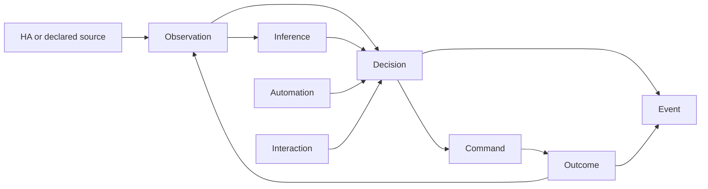

# Housefold Domain Model

**Status:** Shared vocabulary and ownership direction; no wire format or storage schema is defined here.

## Purpose

This document defines the concepts shared across Housefold components and separates observed facts from Housefold's interpretations and actions. It is intended to guide component contracts; it is not an API schema or database design.

## Core concepts

| Concept | Meaning | Primary source or owner |
|---|---|---|
| **Home** | The household environment managed by one Housefold installation. | Housefold installation configuration; exact identity model is open. |
| **Area** | A named physical or logical place, such as a room or floor. | HA may provide area records; Housefold may add mappings or derived groupings. |
| **Device** | A physical or virtual device represented to Home Assistant. | Home Assistant device and integration model. |
| **Entity** | A named capability or state-bearing object exposed by Home Assistant, such as a light or sensor. | Home Assistant entity registry and current state. |
| **Person** | A person relevant to the household and its presence or interactions. | Identity source and mapping are open; do not assume HA person state is the full Housefold identity model. |
| **Observation** | A time-stamped fact received from HA or another declared source, with source and provenance. | The observing source; Housefold may retain a normalized record. |
| **Inference** | A derived claim about the home, a person, or context, based on one or more observations. It may have confidence, freshness, and provenance. | The Housefold capability that derives it. |
| **Automation** | A deterministic rule or workflow that evaluates triggers, conditions, and actions. | Housefold automation capability; ownership/runtime placement is open. |
| **Decision** | The recorded result of evaluating policy or automation logic against available inputs. | The deciding Housefold component, with rule/version and evidence references where practical. |
| **Command** | A request to change state or invoke a capability, addressed through the Runtime and ultimately a target such as an HA service. | The requesting component; execution is reported by the Runtime/Bridge path. |
| **Outcome** | The observed result of a command or decision, including success, failure, timeout, or unknown. | The executor and resulting observation sources. |
| **Interaction** | A user or system exchange that expresses a request, receives a response, or presents a notification. | Housefold interaction surface and its source channel. |
| **Event** | A time-ordered occurrence that a component publishes for subscribers. An event is a message about something that happened, not itself the authoritative current state. | The component that emits it. |

## Relationship model

An observation records what a source reported. An inference records what Housefold concluded from available evidence. A decision records why a rule or policy chose a course of action. A command records the requested effect. An outcome records what the execution path reported and what later observations confirm. These concepts must not be collapsed into a single mutable “state” record.

## Ownership boundaries

- Home Assistant remains authoritative for HA device integrations, entity identifiers, current HA entity state, service definitions, and HA registries.
- Housefold should reference HA-owned identifiers rather than silently redefine them. Any Housefold-specific labels, relationships, or mappings should be explicit and carry their own provenance.
- Housefold is authoritative for its module lifecycle, automation definitions and evaluations, presence inferences, interaction records, and diagnostic explanations that it generates.
- A command request is not proof of execution. The executor's response and resulting state observations determine the outcome.
- A derived value must identify its source inputs and time context well enough to assess freshness and explain why it exists.
- Raw identity and household activity should not be copied to remote services by default. Any export or remote analysis path requires a defined privacy policy.

## Invariants

1. **Facts and interpretations stay distinguishable.** A source observation is not overwritten by an inference.
2. **Inferences carry uncertainty.** Confidence or an equivalent uncertainty indicator is represented when the producing capability can estimate it; unknown is not silently converted to certain.
3. **Time and provenance matter.** Records that can become stale include source and time context.
4. **A request is not a result.** A command is not marked successful merely because it was accepted or sent.
5. **Decisions should be explainable.** Where practical, retain the inputs, rule or policy version, and reason that led to the decision.
6. **Events report occurrences.** Consumers may use events to update projections, but can request authoritative current state from the owning component when needed.
7. **Ownership is explicit.** A component may cache another component's data, but the cache does not become the source of truth.
8. **Sensitive identity is minimized.** Components and remote interfaces receive only the household data needed for their function.

## Open questions

- What identifier and tenancy model represents a Home and its installations?
- How are HA entities mapped to Housefold capabilities and stable cross-version references?
- Which areas and person attributes are HA-owned, Housefold-owned, or derived?
- What event envelope, timestamp rules, ordering, and deduplication guarantees are required?
- Which inferences need confidence, freshness/expiry, or explicit invalidation?
- What records are persisted, for how long, and how are corrections or deletions represented?
- How are command retries, idempotency, partial success, and uncertain outcomes modeled?
- What references connect an interaction to a decision, command, and final outcome?
