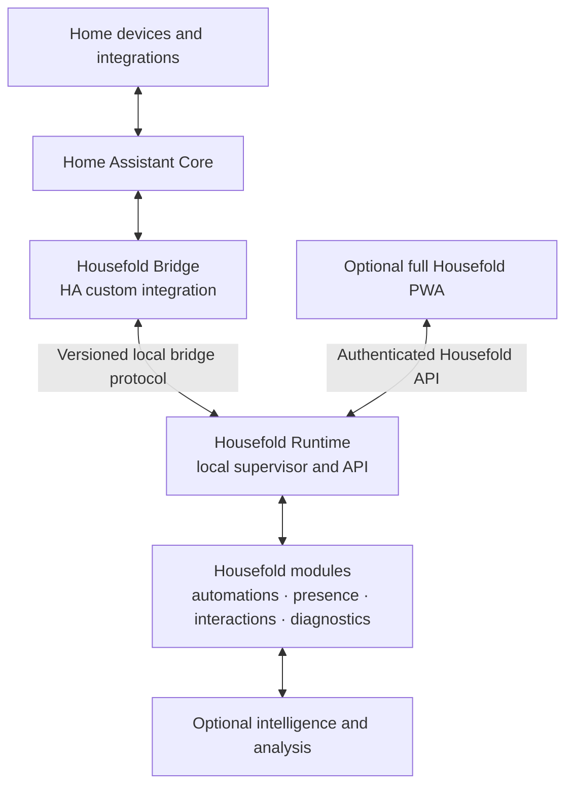

# Housefold System Architecture

**Status:** Initial direction; interfaces and deployment details are not yet stable contracts.

## Goals

- Keep the latency-sensitive Housefold execution path local to Home Assistant.
- Isolate Home Assistant-specific behavior behind a small Bridge.
- Give Housefold modules a stable Runtime API rather than direct dependencies on HA internals.
- Allow an optional remote PWA and future analysis services without making them critical to local operation.
- Make component health, data flow, and important decisions inspectable.

## Context and components

Home Assistant remains the device-facing foundation. The Bridge runs in the HA integration environment. The Runtime is intended to run locally as a supervised Home Assistant app/add-on and provide the Housefold platform boundary. The PWA and heavier analysis may be hosted separately, but their deployment and remote access path remain **Open**.

## Responsibilities

| Component | Owns | Does not own |
|---|---|---|
| Home Assistant | Device integrations, HA entities and services, HA lifecycle and registries | Housefold module lifecycle or Housefold-specific policy |
| Bridge | Translating HA events, state, service calls, registry data, and lifecycle into a versioned contract | Automation decisions, presence inference, intelligence, or UI policy |
| Runtime | Stable Housefold API, module supervision, lifecycle, health, recovery, and routing | Reimplementing the HA device ecosystem |
| Modules | Focused capabilities behind Runtime contracts | Direct coupling to HA internals where the Runtime can provide the needed abstraction |
| PWA | Optional rich human-facing setup and operation surface | Being required for local runtime or automations to function |
| Intelligence | Historical analysis, explanations, pattern discovery, and recommendations | Blocking deterministic local execution |

## Bridge and Runtime boundary

The Bridge needs a defined, versioned protocol. Expected first capabilities include:

- HA lifecycle and connectivity state.
- Entity state snapshots and state-change events.
- Event subscriptions where required.
- Service invocation and result reporting.
- Entity, device, and area registry information needed by Housefold.

The integration and runtime are expected to run in separate containers. The design discussion favored a local network protocol across this container boundary; a shared Unix socket should not be assumed without proving that the HAOS filesystem mounts and lifecycle support it. Unix sockets may still be suitable for communication among Runtime-managed processes if needed.

Message schema, discovery, authentication, reconnect behavior, compatibility negotiation, and transport are **Open** until the Bridge contract is specified and validated on the target HAOS version.

## Data and command flow

1. Home Assistant receives device updates and exposes its state and services.
2. The Bridge streams relevant observations and lifecycle changes to the Runtime.
3. The Runtime normalizes and routes them through Housefold contracts.
4. Modules derive context or make deterministic decisions, retaining links to their inputs where practical.
5. A module requests an action through the Runtime; the Runtime routes the supported operation to the Bridge and HA service layer.
6. The Bridge returns the result and subsequent state changes. Housefold records the command and outcome so the action can be inspected.
7. The optional UI and intelligence capabilities query authenticated Housefold interfaces appropriate to their permissions.

Exact schemas, event ordering guarantees, persistence, and retry semantics are **Open**.

## Failure behavior

- Loss of a remote PWA, VPS, internet connection, or AI service must not stop local deterministic functions that have the data and dependencies they need.
- If the Bridge or Home Assistant is unavailable, the Runtime should expose degraded health and avoid claiming that HA-backed state or commands succeeded.
- If a module fails, the Runtime should isolate and report the failure where practical and preserve the availability of unrelated capabilities.
- After restart, the Runtime should report what was recovered and which state was refreshed from HA. It must not present stale state as current without marking it.

Recovery guarantees, state persistence, module restart policy, and upgrade/rollback behavior remain **Open**.

## Security and privacy boundaries

- Treat HA-to-Runtime, Runtime-to-module, and remote-UI access as explicit trust boundaries.
- Authenticate and authorize control requests; local network location alone is not a sufficient permanent security design.
- Keep raw household identity and activity local by default. Apply a documented minimization/redaction policy before any remote or AI use.
- Give diagnostic and agent-facing interfaces structured, permission-aware data rather than unrestricted access to logs or service calls.
- Record provenance for consequential actions and provide a way to verify outcomes.

Credential storage, remote access topology, role model, retention periods, and detailed threat model are **Open**.

## Deployment direction

- Home Assistant Core hosts the custom Bridge integration.
- The Go Runtime is intended to run locally as a supervised HA app/add-on.
- Housefold modules initially belong to the Runtime's module boundary; independent processes or repositories should be introduced only where useful.
- The full PWA is optional and may be hosted on a VPS. The small Runtime management interface remains available for essential setup and recovery.

Exact packaging, supported HAOS versions, upgrade mechanism, backup format, and remote hosting model remain **Open**.

## Decisions to capture as ADRs

- Bridge protocol and container-to-container transport.
- Runtime/module lifecycle and version compatibility policy.
- Local and remote authentication and authorization.
- State persistence, history, and data retention.
- Installation, upgrade, rollback, and backup strategy.
